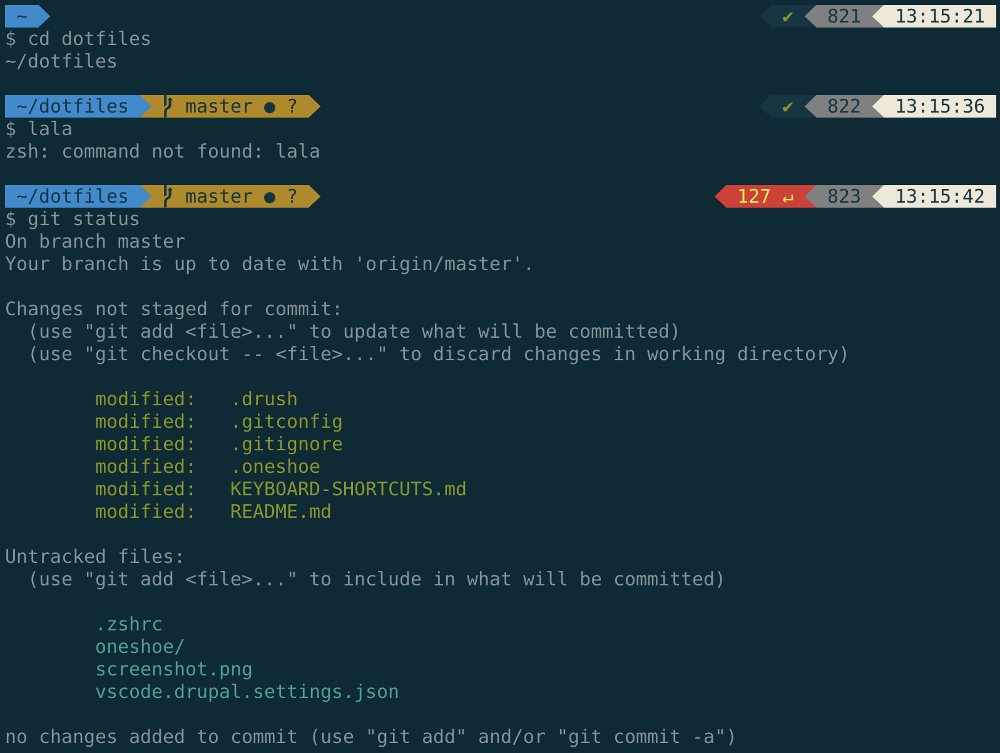

# Marc's dotfiles



**Note:** I chose to leave every possible file in a subfolder to keep my home dir as clean as possible and keep my own custom files separate from the other files.

## Table of content <!-- omit in toc -->

- [Prerequirements](#prerequirements)
- [Installation](#installation)
- [Keyboard shortcuts](#keyboard-shortcuts)
- [Aliases](#aliases)
- [Install Laravel Valet with Mailhog and Xdebug](#install-laravel-valet-with-mailhog-and-xdebug)
- [EditorConfig](#editorconfig)
- [Add custom commands without creating a new fork](#add-custom-commands-without-creating-a-new-fork)
- [Using two Git identities to seperate work and personal accounts](#using-two-git-identities-to-seperate-work-and-personal-accounts)
- [Prefix commit message with a ticket number automatically](#prefix-commit-message-with-a-ticket-number-automatically)
- [Terminal completion](#terminal-completion)
- [Environment variables](#environment-variables)
  - [MacOS nginx](#macos-nginx)
- [MySQL database import and export](#mysql-database-import-and-export)
- [Help](#help)
  - [Git Completion not working](#git-completion-not-working)
- [Contact](#contact)
- [Credits](#credits)
- [To do](#to-do)

## Prerequirements

- Z shell ([Installation instructions](https://github.com/robbyrussell/oh-my-zsh/wiki/Installing-ZSH))
- [iTerm2](https://www.iterm2.com/)
- [Oh My Zsh](https://ohmyz.sh/) ([Installation instructions](https://github.com/robbyrussell/oh-my-zsh#basic-installation))
- [Powerlevel9k](https://github.com/Powerlevel9k/powerlevel9k) ([Installation instructions](https://github.com/Powerlevel9k/powerlevel9k/wiki/Install-Instructions))
- [Solarized theme](https://ethanschoonover.com/solarized/) ([Installation instructions](https://github.com/altercation/solarized/tree/master/iterm2-colors-solarized))

**Note:** I use the `Book` font type of the `DejaVu Sans Mono fo Powerline` font at size `15`.

## Installation

Run `git clone git@github.com:MGHollander/zsh-dotfiles.git dotfiles` in the root of your user directory.

Replace content of `~/.zshrc` or just add the code on the bottom:

```bash
# Load custom dotfiles
source ~/dotfiles/.zshrc;
```

Add to `~/.gitconfig`

```ini
# Load custom git config
[include]
    path = ~/dotfiles/.gitconfig
```

**NOTE:** Some git config files might be overwritten by Git GUI tools. For  example: My `~/dotfiles/.gitignore` wasn't loading. When I checked my `~/.gitconfig` the `excludesfile` variable was overwritten by Sourcetree. Therefore I have to configure my own global .gitignore in the Sourcetree settings.

## Keyboard shortcuts

[My favorite keyboard shortcuts](docs/KEYBOARD-SHORTCUTS.md)

## Aliases

[All available aliases](docs/ALIASES.md)

## Install Laravel Valet with Mailhog and Xdebug

[Read all about it!](docs/VALET-INSTALLATION.md)

## EditorConfig

If you want to use the `.editorconfig` then you have to move it to the root of the user directory.

## Add custom commands without creating a new fork

If `~/dotfiles/.extra` exists, it will be sourced along with the other files. You can use this to add a few custom commands without the need to fork this entire repository, or to add commands you don’t want to commit to a public repository.

## Using two Git identities to seperate work and personal accounts

Às of [Git 2.13.0](https://github.com/git/git/blob/v2.13.0/Documentation/RelNotes/2.13.0.txt) there is a possibility to [include confitional config](https://git-scm.com/docs/git-config#_conditional_includes). This is usefull when you use your machine for both work and private.

An example of how I use it.

My `~/.gitconfig`:

```ini
[user]
    name = Marc Hollander
    email = my@personal.mail

[includeIf "gitdir:~/dev/work/"]
    path = ~/.gitconfig-work
```

My `~/.gitconfig-work`:

```ini
[user]
    name = Marc Hollander (Work)
    email = my@work.mail
```

By default my commits will be in name of my personal account. When I commit something from a repository inside the `~/dev/work/` directory, then it will be in name of my work account.

## Prefix commit message with a ticket number automatically

Based on
<https://medium.com/better-programming/how-to-automatically-add-the-ticket-number-in-git-commit-message-bda5426ded05>

Examples of ticket numbers that are extracted:

```txt
myproj-123-some-feature → MYPROJ-123
feature/myproj-456-some-other-feature → MYPROJ-456
bugifx/myproj-789 →  MYPROJ-789
123_some_feature →  #123
123-another-feature →  #123
```

Copy `prepare-commit-msg` to the default Git hook template folder. On my machine this folder is placed add `/usr/local/git/share/git-core/templates`. These templates will be copied to every new repository that you create or clone on your machine.

**NOTE:** You have to copy the file to existing repositories manually. You can copy the file to all existing repositories by running `echo /path/to/projects/*/.git/hooks/ | xargs -n 1 cp ~/dotfiles/prepare-commit-msg`, but you should be aware that it will overwrite existing files.

**NOTE:** Make sure the file is executable after you have copied it to a repository manually. Run `chmod +x /path/to/repo/.git/hooks/pre-commit-msg` for the correct permissions. You can also use a wildcard here if you have copied the file to multiple existing repositories using the above command. This should look something like this: `chmod +x /path/to/projects/*/.git/hooks/prepare-commit-msg`.

Source: <https://medium.com/better-programming/how-to-automatically-add-the-ticket-number-in-git-commit-message-bda5426ded05>

## Terminal completion

You can add paths to the `CDPATH` variable in `.path` for shortcuts when you use the `cd` command.

## Environment variables

The .exports file contains an environment variable to use to check if you are on a certain environment. The variable is named `APP_ENV`.

You should also set the environment variable to your development environments.

### MacOS nginx

My nginx config is located in `/usr/local/etc/nginx` and environment variables are already set in the fastcgi_params file.

Append `fastcgi_param APP_ENV development;` to a new line in `/usr/local/etc/nginx/fastcgi_params`

_Source: <https://stackoverflow.com/a/45419230>_

## MySQL database import and export

There are scripts with aliases available to import and export MySQL databases. Run `dbi --help` and `dbe --help` for
instructions to use these scripts.

There are some default MySQL settings set in `scripts/mysql/mysql-settings.sh`.
You can change these or override them in one of the other configuration files,
like `.extra`. Example:

```bash
export MYSQL_HOST=localhost
export MYSQL_USER=root
export MYSQL_PASS=root
export MYSQL_CHAR_SET=utf8mb4
export MYSQL_COLLATE=utf8mb4_unicode_ci
```

_Don't forget to restart the terminal after you have changed a setting that is overwritten using the method above._

## Help

### Git Completion not working

Run `chmod -X ~/.git-completion.bash` and restart your terminal. ([source](http://thegeekywizard.com/2014/03/autocomplete-for-git-mac-osx-terminal/))

## Contact

Please [create an issue](https://gitlab.com/MGHollander/dotfiles/issues) if you have any questions or suggestions.

## Credits

- [Mathias’s dotfiles](https://github.com/mathiasbynens/dotfiles)

## To do

- Clean up and add a list with all functionalities included in the dotfiles. Describe things that happen in files that
  do not have aliases or functions, but do have useful functionalities (.bash_prompt, .exports, etc.).
- Check if the original dotfiles contain an installer and (re)add this to my version. Also add new stuff such as
  bash-completion (via Homebrew) and drush. Maybe run `brew services list` to see what is installed via Homebrew.
- Split up the scripts in smaller bits. For example valet/create-db.sh and mysql/create-db.sh. That makes it easy to
  swap out tasks in the main script. And makes it more flexibel.
